# SUSTech Academic Marp Themes 

# 南方科技大学Marp学术汇报主题

- 该仓库包含两个主题，主题一主题色为绿色，主题二主题色为橙色
-  借鉴了 https://github.com/kaisugi/marp-theme-academic 和 https://github.com/liyunwei-3558/MyMd2PPT 
- 主题一第一次使用和导出的时候可能速度极其慢，因为要从网络上下载资源，此时请使用梯子
- If working with vscode-marp-extension, do not delete `.vscode` folder, which clerifies the location of css theme file. / 如果使用vscode-marp插件作为编辑器，请勿删除`.vscode`文件夹

 

## 主题一演示效果

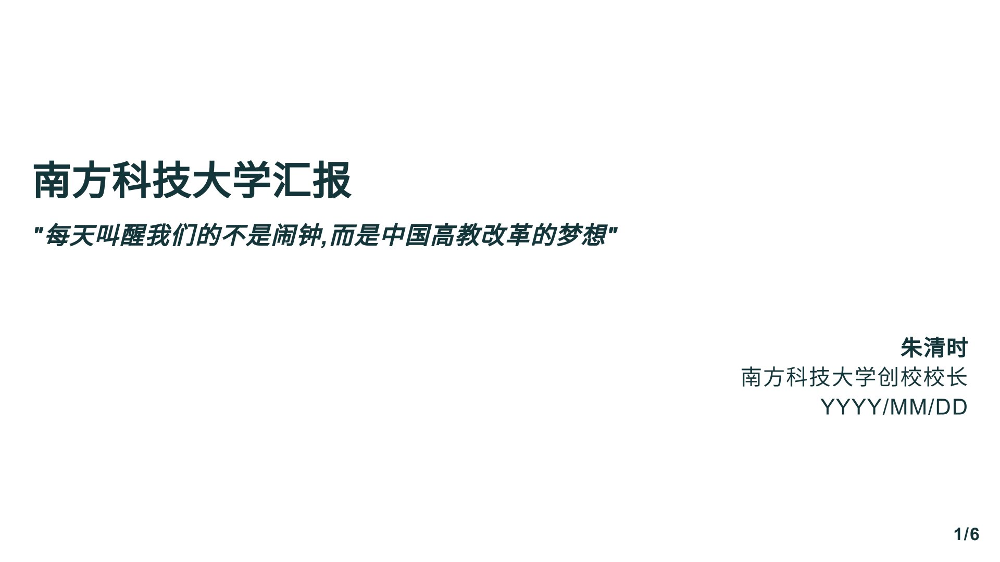
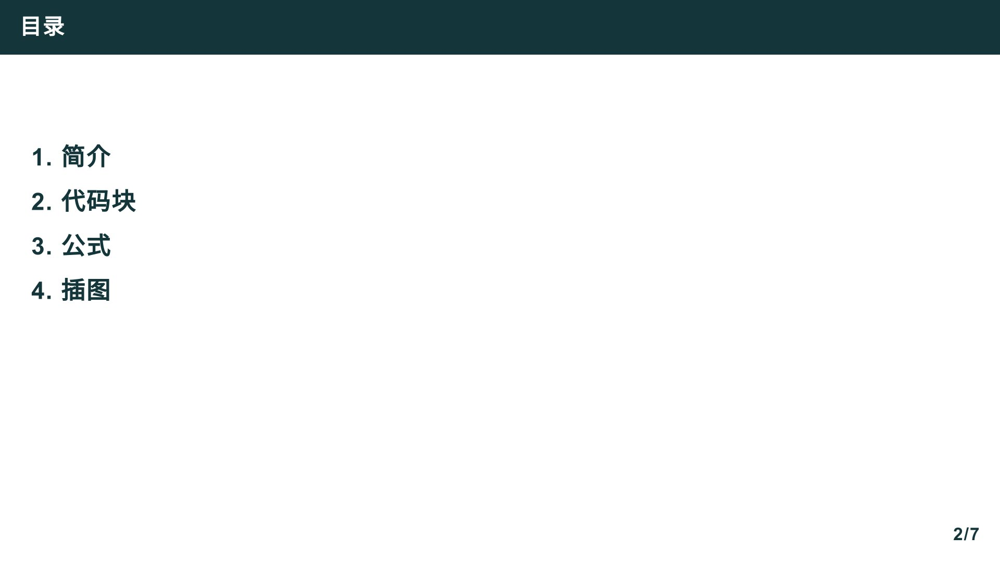
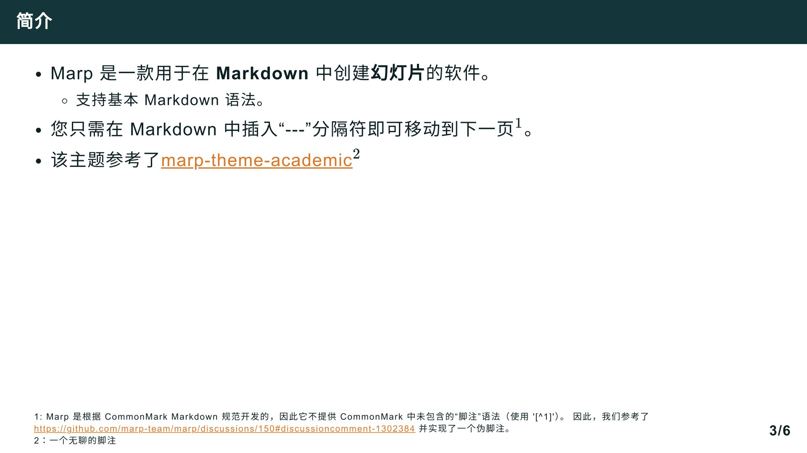
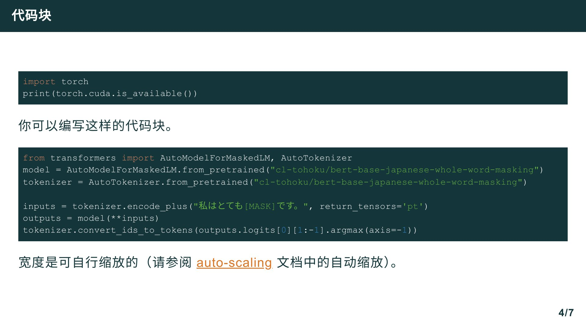
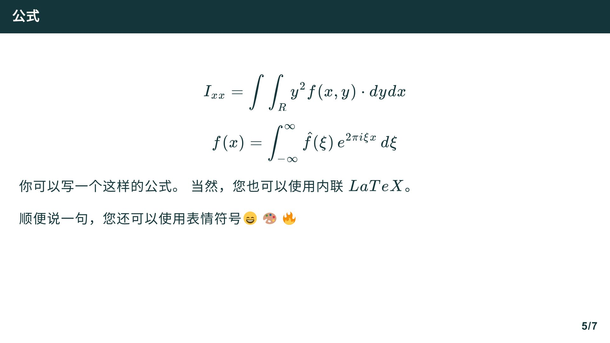
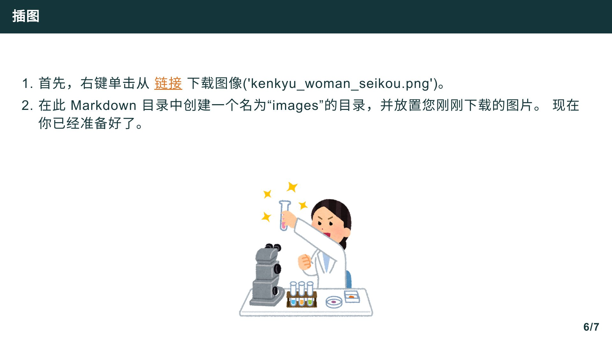

---

## 主题二演示效果
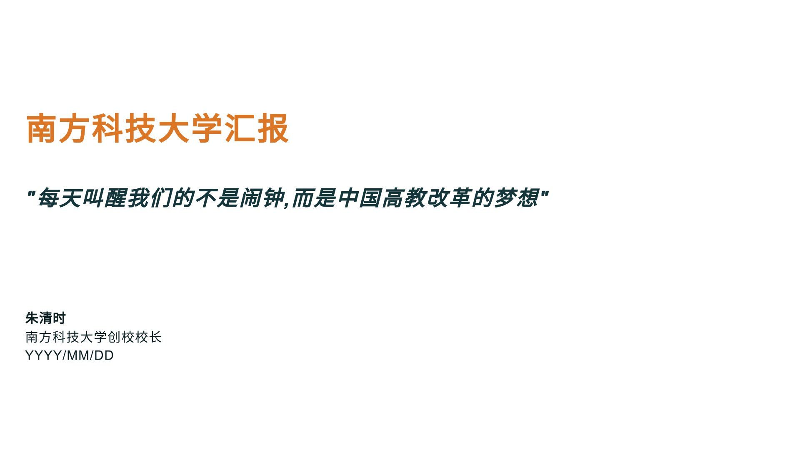
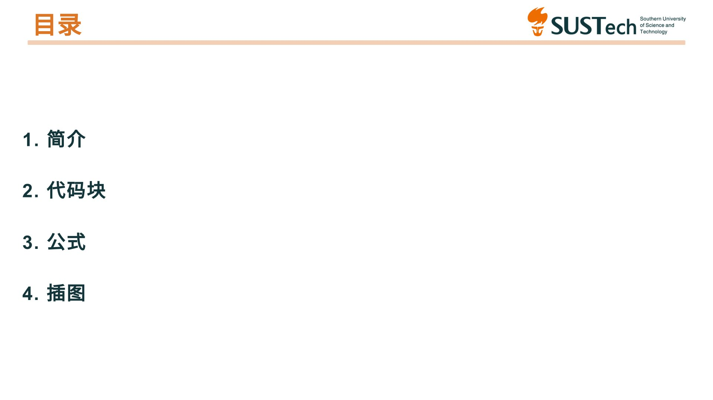

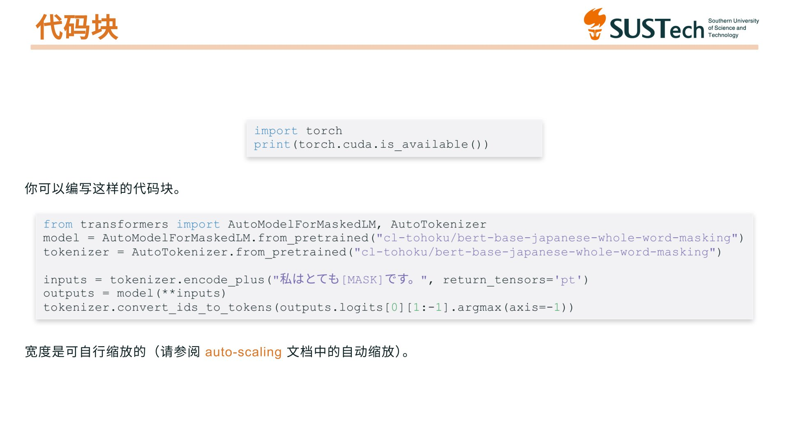
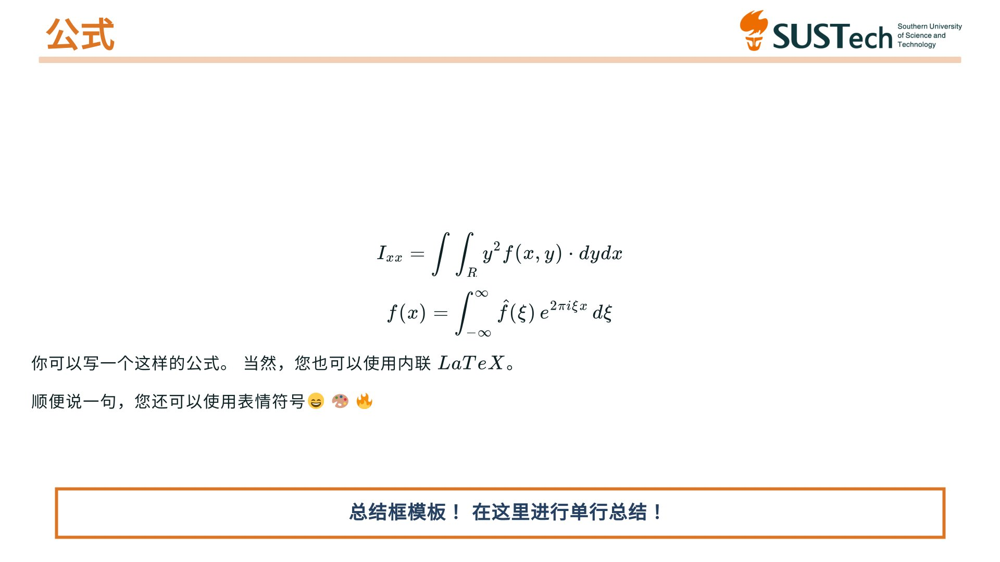
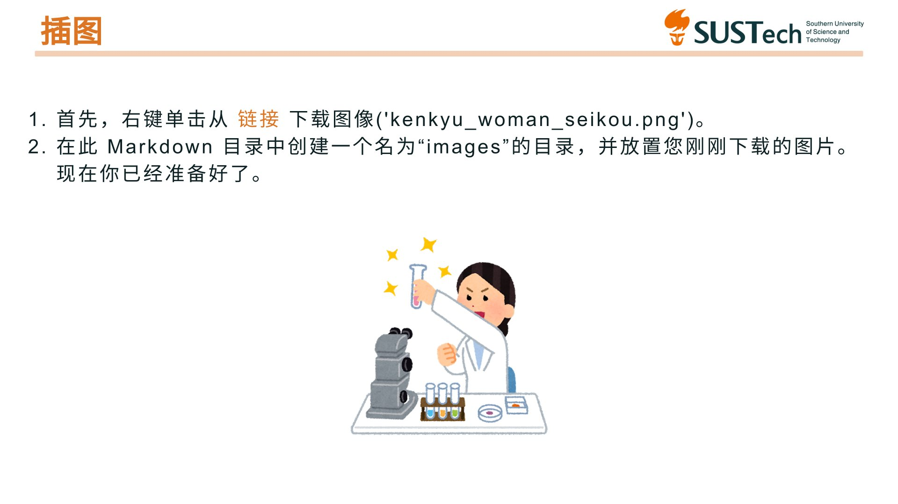

