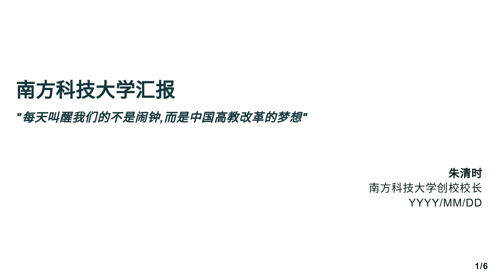
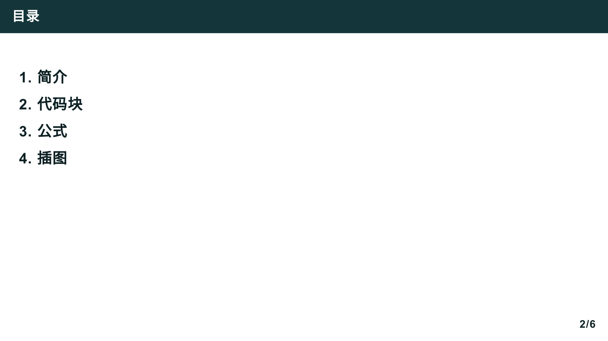
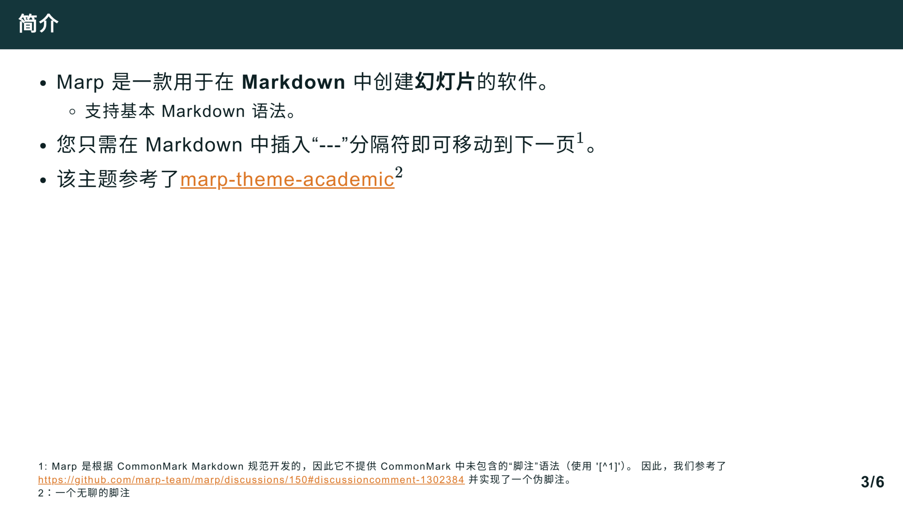
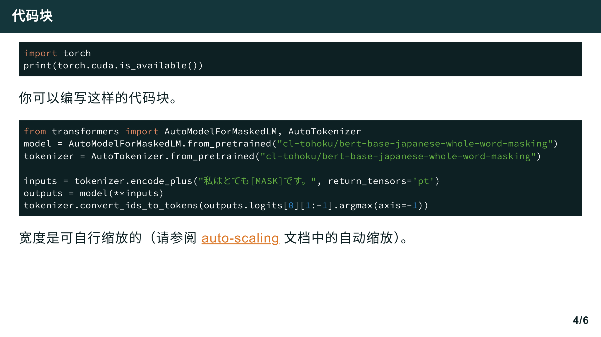
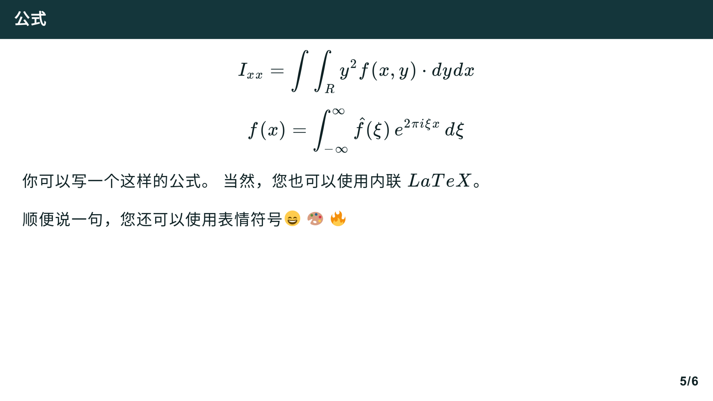
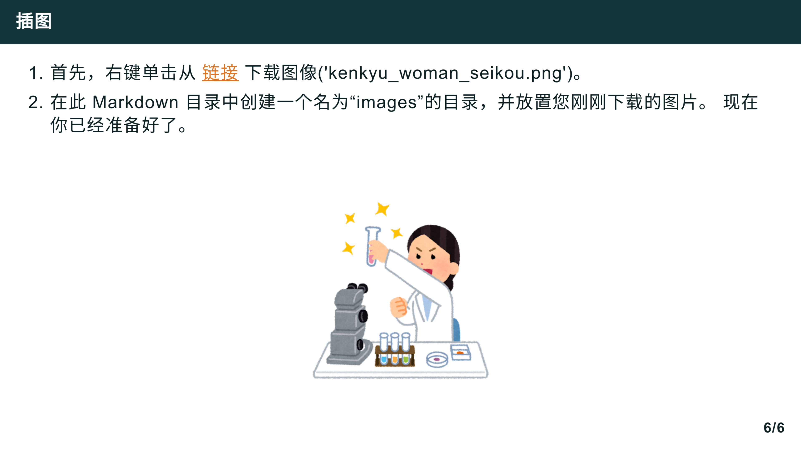

# SUSTech Academic Marp Themes 

# 南方科技大学Marp学术汇报主题

> Based on ["marp-theme-academic"](https://github.com/kaisugi/marp-theme-academic). 
>
> 
>
> If working with vscode-marp-extension, do not delete `.vscode` folder, which clerifies the location of css theme file. / 推荐使用vscode-marp插件作为编辑器，请勿删除`.vscode`文件夹

---

